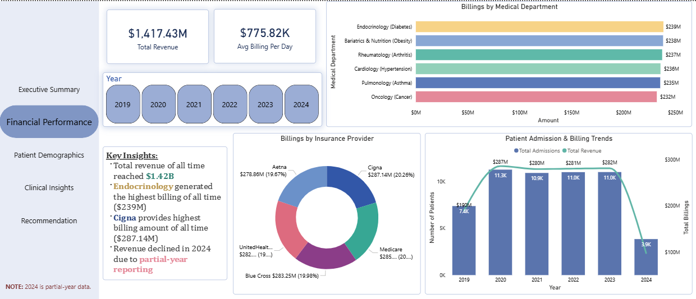

# Healthcare-Analytics-Dashboard
An executive-grade interactive Power BI dashboard analyzing 55.5K patient admissions across clinical quality, financial performance, and demographics.

## 📊 Interactive Dashboards

### Executive Summary

### Financial Performance

### Patient Demographics

### Clinical Insights

### Strategic Recommendations

---

## 🔍 Key Insights

* **Financial Driver:** Endocrinology leads hospital revenue, generating **$239M** in total billings.
* **Payer Leader:** Cigna represents the highest-value commercial contract at **$287.14M**.
* **Primary Demographic:** Senior citizens aged **66+** form the dominant patient cohort.
* **Bed Bottleneck:** Asthma patients experience the longest average hospital stay at **15.7 days**.
* **Volume Peak:** Arthritis is the highest-volume medical condition with **9,308 admissions**.

---

## 🎯 Strategic Recommendations

* **Reduce Bed Blocking:** Streamline clinical discharge pipelines specifically for Asthma patients to lower the 15.7-day average length of stay.
* **Resource Allocation:** Expand geriatric clinical infrastructure and staffing models to support the rapidly growing 66+ patient demographic.
* **Contract Leverage:** Use massive volume metrics to renegotiate commercial insurance reimbursement rates with lower-performing networks like Aetna.

---

## 🛠️ Tech Stack & DAX Methods
* **Data Modeling:** Star Schema (`fact_table` linked to `medics_table` and `calendar_table`).
* **Time Intelligence:** Used `SAMEPERIODLASTYEAR` to compute Year-over-Year (YoY) revenue growth rates.
* **Context Manipulation:** Utilized `CALCULATE` and `DIVIDE` to isolate patient demographic distributions safely.
* **UI/UX Design:** Custom vertical sidebar navigation utilizing native Page Navigators with interactive Hover/Pressed visual states.
